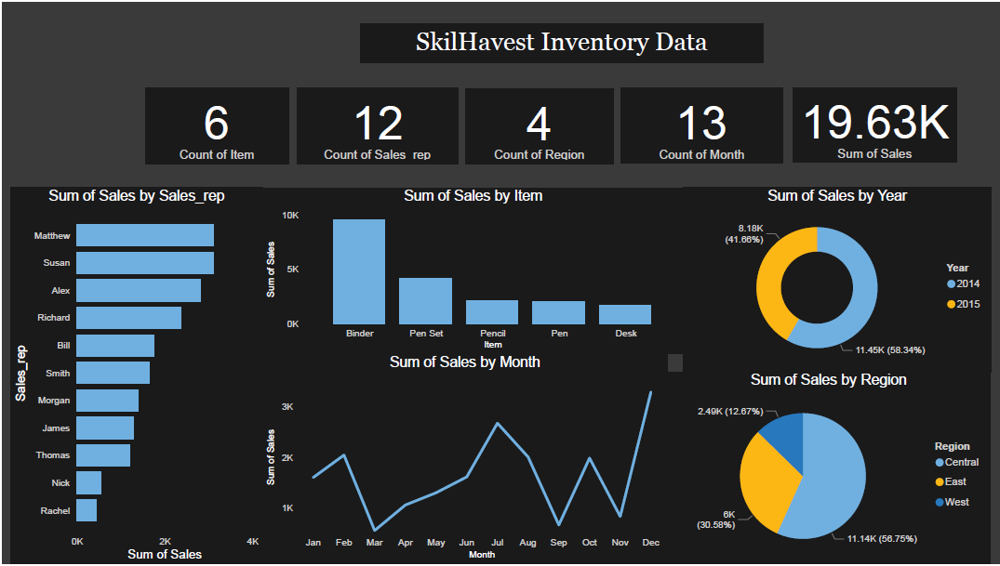

# **SkilHarvest-data-documentation**
- My First documentation of SkilHarvest Data Analysis project work 

---
## Project Overview
This Data analysis project seeks to generate insight into Sales inventory records over a number of years. By analysing each parameter in these data it gives a clearer view of how well each item is doing in terms of sales and how to maximize sales. Further more it gives insight to customers behavior and prefrence when buying stationaries and how to better strategise sales to meet the teaming demands of customers.  


##**Project Outline**
- SkilHarvest-data-documentation [SkilHarvest data documentation](#skilharvest-data-documentation)
- Project Overview [Project Overview](#project-overview)
- Data Source [Data Source](#data-source)
- Data Source [Data Analysis](#data-analysis)


## Data Source 
The source of data used in this Analysis is from skilhavest practical class  [ClICK HERE TO DOWNLOAD](http://tinyurl.com/2hdwhpvm) 


---
## Tools Used 
 tool used for both the Analysis and Visulaisation of the above data Includes 
- PowerBI
- Google sheet [click Here](http://tinyurl.com/suswph5a)

---

## Data Analysis

Below are some of the query codes used to extract some of the vital samples from the total population of data made available.

- Sales of binder item and pencil in 2015 
```
=QUERY(A:H, "SELECT C,F WHERE (C = 'Binder' OR C ='Pencil') AND F = 2015",1)
```
- Sales in Central and East region in 2014
```
=QUERY(A:H, "SELECT A,H,F WHERE (A ='Central' OR A ='East') AND F= 2014",1) 
```
- Sale  in August and september 2014
```
=QUERY(A:H,"SELECT E,F,H WHERE (E = 'Aug' OR  E = 'Sep') AND F = 2014",1)
```
- Show sales of item that start with pen, include their region, sales rep, and year
```
=QUERY(A:H,"SELECT A,B,C,F WHERE C LIKE 'Pen%'",1)
```
- Show sales of item that ends with Sk, include their region, sales rep, and year
```
=QUERY(A:H,"SELECT A,B,C,F WHERE C LIKE '%sk'",1)
```
---

## Conclusion/Findings



From the dash Board it can be deduced that Binders have the highest sales with most of the sales ocurring in December,July and February respective, Also two sales representatives have the highst number of sales with central region being the region with the highest sales volume and the west have the least number of sales.
 Also December holds the month with the highest sales volume and a sharp drop was withnessed in February with march being the Month with the lowest sales.
